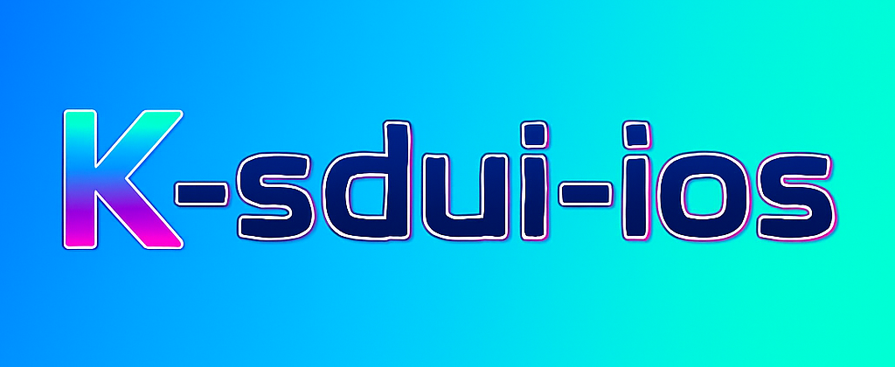

<a href="https://opensource.org/licenses/MIT">

</a>
<a href="https://github.com/MessageKit/MessageKit/issues">

</a>

- Launguage : [🇰🇷](./README_KR.md)

`k-sdui-ios` is a library that helps you easily implement Server-Driven UI in SwiftUI.
Renders SwiftUI views by decoding JSON into view components based on their types.



## ⚡️ Features

- [X] CommonComponent : Defines shared SwiftUI view modifiers
- [X] TextComponent : Renders as SwiftUI `Text`
- [X] ButtonComponent : Renders as SwiftUI `Button`
- [X] ImageComponent : Renders as SwiftUI `Image` or `AsyncImage`
- [X] SpacerComponent : Renders as SwiftUI `Spacer`
- [X] RectangleComponent : Renders as SwiftUI `Rectangle`
- [X] RoundedRectangleComponent : Renders as SwiftUI `RoundedRectangle`
- [X] ScrollComponent : Renders as SwiftUI `ScrollView`
- [X] CustomComponent : Renders as SwiftUI `EmptyView`
- [X] Layout : Renders as SwiftUI `HStack`, `VStack`, `ZStack`, `LazyHStack`, `LazyVStack`


## 🌈 Quick

This code demonstrates how to load and inspect the structure of each JSON file located in the `Example` directory.


## 👷‍♂️ Basic Flow

1. Decode `SDUIScene`
2. Define layout using `SDUIScene` → `SDUIContainer` → `SDUILayout` and include an array of `SDUIView`s
3. Use the `render` function to convert into SwiftUI Views

### Scene

```swift
public struct SDUIScene: Codable, Identifiable {

    public let id = UUID()
    public var hasNavigationBar: Bool
    public var container: SDUIContainer
    
    ...
    
```

- `hasNavigationBar`: Indicates whether to show a navigation bar
- `container`: Top-level container view


### Layout 

```swift
public struct SDUILayout: Codable {
    public var type: String
    public var spacing: CGFloat?
    public var alignment: String

    ...
```

- `type`: Renders `HStack`, `VStack`, or `ZStack` based on `h`, `v`, or `z`. For `lh` or `lv`, it renders `LazyHStack` or `LazyVStack`
- `spacing`: Spacing between views
- `alignment`: Alignment direction

## 🧱 Component Types

### CommonComponent : Defines shared SwiftUI view modifiers

All components conform to this protocol.

```swift
    public protocol CommonComponent: Codable {
        var componentId: String { get }
        var padding: [PaddingComponent]? { get }
        var frame: FrameComponent? { get }
        var extreamFrame: ExtreamFrameComponent? { get }
        var foregroundColor: String? { get }
        var backgroundColor: String? { get }
        var cornerRadius: CGFloat? { get }
        var overlay: SDUIView? { get }
    }
```

- `componentId`: Unique identifier for the component
- `padding`: Applies padding with specified edges and spacing
- `frame`: Applies width/height-style frame modifiers
- `extreamFrame`: Applies minWidth/minHeight-style frame modifiers
- `foregroundColor`: Applies `foregroundStyle` modifier
- `backgroundColor`: Applies `background` modifier
- `cornerRadius`: Applies corner radius
- `overlay`: Applies overlay modifier


### TextComponent : Renders as SwiftUI `Text`

``` swift
public struct TextComponent: CommonComponent {

    ... CommonComponent 
    
    public let text: String
    public let font: FontComponent?
    public let lineLimit: Int?
    
    ...
```

- `text`: The string to display
- `font`: Applies font modifiers
- `lineLimit`: Maximum number of lines

### ButtonComponent : Renders as SwiftUI `Button`

``` swift
public struct ButtonComponent: CommonComponent {

    ... CommonComponent

    public let text: String
    public let action: ActionComponent?
    public let customViews: SDUIView?
    
    ...

```

- `text`: Used when rendering a simple text-based button
- `action`: Action handler if defined
- `customViews`: Used for custom button content


### ImageComponent : Renders as SwiftUI `Image` or `AsyncImage`

``` swift
public struct ImageComponent: CommonComponent {

    ... CommonComponent

    public let imageURL: String
    
    ...

```

- `imageURL`: If it’s a valid URL, renders with `AsyncImage`. Otherwise, uses asset name to render `Image`

### SpacerComponent : Renders as SwiftUI `Spacer`

``` swift
public struct SpacerComponent: CommonComponent {

    ... CommonComponent
    

```

### RectangleComponent : Renders as SwiftUI `Rectangle`

``` swift
public struct RectangleComponent: CommonComponent {

    ... CommonComponent
    

```

### RoundedRectangleComponent : Renders as SwiftUI `RoundedRectangle`

``` swift
public struct RoundedRectangleComponent: CommonComponent {

    ... CommonComponent
    
    public let strokeComponent: StrokeComponent?
    
    ...
```

- `strokeComponent`: Applies stroke color and line width

### ScrollComponent : Renders as SwiftUI `ScrollView`

``` swift
public struct ScrollComponent: CommonComponent {

    ... CommonComponent
    
    public let axis: String
    public let showIndicator: Bool
    public let containerViews: SDUIView
    
    ...

```

- `axis`: Scroll direction (horizontal or vertical)
- `showIndicator`: Whether to show scroll indicators
- `containerViews`: Views contained within the scroll view


### CustomComponent : Renders as SwiftUI `EmptyView`

``` swift
public struct CustomComponent: CommonComponent {

    ... CommonComponent
    

```

### SDUIConatiner : A container view for nested layout and views

``` swift
public struct SDUIContainer: CommonComponent {

    ... CommonComponent
    
    public var layout: SDUILayout
    public var views: [SDUIView]
    
    ...
```

- `layout`: Defines layout structure
- `views`: Array of views inside the layout
