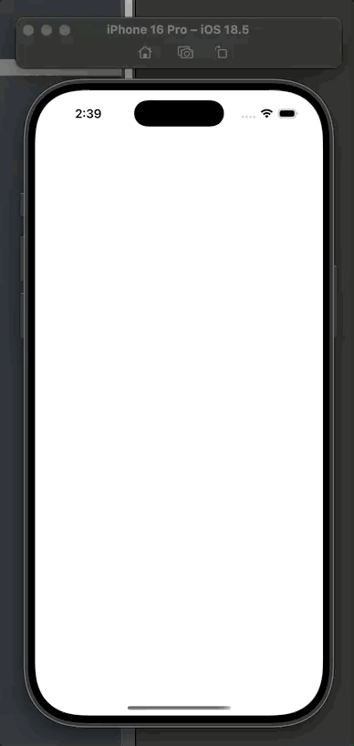

<a href="https://opensource.org/licenses/MIT">

</a>
<a href="https://github.com/MessageKit/MessageKit/issues">

</a>

`k-sdui-ios`는 SwiftUI에서 Server-Driven UI를 손쉽게 구현하도록 도와주는 라이브러리입니다.
JSON을 디코딩하여 SwiftUI의 적절한 Type으로 렌더링합니다.


## ⚡️ Features

- [X] CommonComponent : SwiftUI의 View의 공통 수정자들을 정의한 component
- [X] TextComponent : SwiftUI의 Text로 렌더링
- [X] ButtonComponent : SwiftUI의 Button 렌더링
- [X] ImageComponent : SwiftUI의 Image, AsyncImage 렌더링
- [X] SpacerComponent : SwiftUI의 Spacer 렌더링
- [X] RectangleComponent : SwiftUI의 Rectangle 렌더링
- [X] RoundedRectangleComponent : SwiftUI의 RoundedRectangle 렌더링
- [X] ScrollComponent : SwiftUI의 `ScrollView` 렌더링
- [X] CustomComponent : SwiftUI의 EmptyView 렌더링
- [X] Layout : Renders as SwiftUI `HStack`, `VStack`, `ZStack`, `LazyHStack`, `LazyVStack`


## 🌈 Quick

`Example` 폴더로 이동하여 예제 프로젝트에서 JSON의 형식을 참고하세요.



## 👷‍♂️ 기본 작동방식

1. SDUIScene을 Decoding
2. SDUIScene -> SDUIContainer -> SDUILayout으로 Layout 정의 후 내부 SDUIView 배열 정의
3. render 함수를 통해 SwiftUI View로 변환 

### Scene

```swift
public struct SDUIScene: Codable, Identifiable {

    public let id = UUID()
    public var hasNavigationBar: Bool
    public var container: SDUIContainer
    
    ...
    
```

- `hasNavigationBar` : 네비게이션바 활성화 여부
- `container` : 최상단 컨테이너


### Layout 

```swift
public struct SDUILayout: Codable {
    public var type: String
    public var spacing: CGFloat?
    public var alignment: String

    ...
```

- `type` : `h`, `v`, `z`에 따라서 `HStack`, `VStack`, `ZStack` 렌더링, `lh`, `lv`에 따라서 `LazyHStack`, `LazyVStack` 렌더링
- `spacing` : spacing 값 지정
- `alignment` : 정렬방향 지정

## 🧱 Component 종류

### CommonComponent : SwiftUI의 View의 공통 수정자들을 정의한 component

모든 Component는 해당 프로토콜을 채택하여 구현

```swift
    public protocol CommonComponent: Codable {
        var componentId: String { get }
        var padding: [PaddingComponent]? { get }
        var frame: FrameComponent? { get }
        var extreamFrame: ExtreamFrameComponent? { get }
        var foregroundColor: String? { get }
        var backgroundColor: String? { get }
        var cornerRadius: CGFloat? { get }
        var overlay: SDUIView? { get }
    }
```

- `componentId` : component 고유명
- `padding` : padding 수정자를 배열로 적용, edge와 spacing을 전달  
- `frame` : frame 수정자 중 width, height ~ 형식에 적용
- `extreamFrame` : frame 수정자 중 minWidth ~ 형식에 적용
- `foregroundColor` : `foregroundStyle` 수정자 적용
- `backgroundColor` : `background` 수정자 적용
- `cornerRadius` : `cornerRadius` 수정자 적용
- `overlay` : `overlay` 수정자 적용


### TextComponent : SwiftUI의 Text로 렌더링

``` swift
public struct TextComponent: CommonComponent {

    ... CommonComponent 
    
    public let text: String
    public let font: FontComponent?
    public let lineLimit: Int?
    
    ...
```

- `text` : 텍스트에 들어갈 내용
- `font` : 텍스트 `font` 수정자 적용 
- `lineLimit` : 라인 수 `lineLimit` 수정자 적용

### ButtonComponent : SwiftUI의 Button 렌더링

``` swift
public struct ButtonComponent: CommonComponent {

    ... CommonComponent

    public let text: String
    public let action: ActionComponent?
    public let customViews: SDUIView?
    
    ...

```

- `text` : 텍스트로만 구성된 버튼 사용시 적용
- `action` : action이 있는 경우 핸들러를 삽입 
- `customViews` : 커스텀버튼을 사용하는 경우 삽입

### ImageComponent : SwiftUI의 Image, AsyncImage 렌더링

``` swift
public struct ImageComponent: CommonComponent {

    ... CommonComponent

    public let imageURL: String
    
    ...

```

- `imageURL` : imageURL이 URL 형식인 경우 AsyncImage로 렌더링, 아닌 경우 asset의 저장된 이름 매칭하여 Image로 렌더링

### SpacerComponent : SwiftUI의 Spacer 렌더링

``` swift
public struct SpacerComponent: CommonComponent {

    ... CommonComponent
    

```

### RectangleComponent : SwiftUI의 Rectangle 렌더링

``` swift
public struct RectangleComponent: CommonComponent {

    ... CommonComponent
    

```

### RoundedRectangleComponent : SwiftUI의 RoundedRectangle 렌더링

``` swift
public struct RoundedRectangleComponent: CommonComponent {

    ... CommonComponent
    
    public let strokeComponent: StrokeComponent?
    
    ...
```

- `strokeComponent`: storke 수정자의 색상과 라인너비를 적용

### ScrollComponent : SwiftUI의 `ScrollView` 렌더링

``` swift
public struct ScrollComponent: CommonComponent {

    ... CommonComponent
    
    public let axis: String
    public let showIndicator: Bool
    public let containerViews: SDUIView
    
    ...

```

- `axis` : 스크롤의 방향 지정
- `showIndicator` : 인디케이터 표시 활성여부
- `containerViews` : 내부 들어갈 View 배열

### CustomComponent : SwiftUI의 EmptyView 렌더링

``` swift
public struct CustomComponent: CommonComponent {

    ... CommonComponent
    

```

### SDUIConatiner : SwiftUI의 담고 있는 컨테이너 (별도)

``` swift
public struct SDUIContainer: CommonComponent {

    ... CommonComponent
    
    public var layout: SDUILayout
    public var views: [SDUIView]
    
    ...
```

- `layout` : 레이아웃을 지정 
- `views` : 레이아웃 내부에 들어갈 View 배열
